# Product Requirements Document (PRD) - Proof of Concept

## 1. Overview

Claimy is an **Agentic AI Claims Platform** that leverages multi-agent systems powered by foundation models (GPT-4.1, GPT-4o) to automate and augment the end-to-end processing of insurance claims. This Proof of Concept explores cutting-edge agentic AI architectures where autonomous agents collaborate to deliver instant, explainable claim recommendations, intelligent email generation, and real-time operational insights—reducing average resolution time to seconds while preserving regulatory compliance and customer trust.

### 1.1 Agentic AI Approach

Unlike traditional single-model AI systems, Claimy employs a **multi-agent architecture** where specialized AI agents work collaboratively:

- **Assessment Agent**: Analyzes claims using foundation models for decision-making
- **Communication Agent**: Generates personalized customer communications
- **Orchestrator Agent**: Coordinates workflow between specialized agents
- **Compliance Agent**: Ensures regulatory adherence and audit trails
- **Learning Agent**: Captures feedback and improves system performance

This agentic approach enables more robust, explainable, and scalable claim processing compared to monolithic AI systems.

---

## 2. Goals & Success Metrics

| Goal | Metric | Current Baseline* | Target |
|------|--------|------------------|---------|
| Increase straight-through automation | Automation Rate | 85.5% | 90% in 6 months |
| Improve decision quality | Decision Accuracy Rate | 75.5% | ≥ 85% |
| Accelerate processing speed | Avg. Claim Resolution Time | 25 sec | ≤ 15 sec |
| Close feedback loop | % of claims with human feedback | 0% | ≥ 80% |
| Customer satisfaction | NPS after claim closure | n/a | +10 pts |

*Figures taken from the current "Claims Inbox" dashboard screenshots.*

---

## 3. Problem Statement

Manual claim handling is slow, error-prone, and expensive. Agents must cross-validate policies, documents, and timelines, then craft customer communications—often across disjointed systems. We need a secure, explainable AI layer that:

1. Triages and decides claims instantly.
2. Surfaces rationale and missing information for human audit.
3. Drafts customer messages and internal updates.
4. Provides live operational KPIs.

---

## 4. Personas

| Persona | Key Needs | Pain Points |
|---------|-----------|-------------|
| Claims Handling Agent | Accurate AI recommendations, one-click email drafts, audit trail | Context switching, repetitive writing, time pressure |
| Claims Team Manager | Dashboard of automation rate & accuracy, override controls | Lack of visibility, untrusted black-box AI |
| End Customer (Claimant) | Fast, fair decision, clear requests for docs | Long waits, unclear next steps |
| Compliance Officer | Explainability, data privacy, SOC2/GDPR adherence | Regulatory risk |
| ML Ops / Data Scientist | Feedback signals, model version control, monitoring | No centralized feedback loop |

---

## 5. User Stories & Use-Cases

1. **As a Claims Agent**, I want to see an AI "Approve / Reject / Needs Review" suggestion with a checklist of completed and missing validations so that I can verify the decision quickly.

2. **As a Claims Agent**, I want the AI to draft a personalized email requesting missing documents so that I can send it with minimal edits.

3. **As a Manager**, I want to view real-time KPIs (automation rate, resolution time, accuracy) so that I can spot bottlenecks.

4. **As an Agent**, I want to give thumbs-up/down feedback on AI decisions so that future recommendations improve.

5. **As a Compliance Officer**, I want each AI decision to store an explanation and data sources so that I can prove due diligence.

---

## 6. Features & Functional Requirements

### 6.1 Multi-Agent Assessment System

| # | Requirement | Priority |
|---|-------------|----------|
| 6.1.1 | **Orchestrator Agent**: Coordinates claim processing workflow between specialized agents using GPT-4.1/GPT-4o | P0 |
| 6.1.2 | **Assessment Agent**: Generate Approve / Reject / Human Review with confidence score using foundation models | P0 |
| 6.1.3 | **Reasoning Agent**: Display explainable rationale with bullet checklist (policy coverage, document completeness, timeline consistency) | P0 |
| 6.1.4 | **Document Agent**: Identify and highlight missing artifacts (e.g., "train-ticket invoice") using multimodal capabilities | P0 |
| 6.1.5 | **Feedback Agent**: Capture agent override decisions and human feedback for continuous learning | P0 |
| 6.1.6 | **Audit Agent**: Log all agent decisions, rationale, and interactions in compliance audit table | P0 |

### 6.2 Agentic Communication System

| # | Requirement | Priority |
|---|-------------|----------|
| 6.2.1 | **Communication Agent**: Draft personalized customer emails using GPT-4o's advanced language capabilities | P0 |
| 6.2.2 | **Translation Agent**: Support multi-language templates (EN, FR, DE) with cultural context awareness | P1 |
| 6.2.3 | **Context Agent**: Embed claim-specific metadata and maintain conversation history across interactions | P0 |
| 6.2.4 | **Delivery Agent**: Provide one-click send with delivery tracking and status updates | P0 |
| 6.2.5 | **Tone Agent**: Adapt communication style based on claim status and customer sentiment analysis | P1 |

### 6.3 Claims Inbox & Dashboard

| # | Requirement | Priority |
|---|-------------|----------|
| 6.3.1 | Table of tickets with AI Recommendation, Human Feedback, Submission Date | P0 |
| 6.3.2 | KPI tiles (Automation Rate, Avg. Resolution Time, Decision Accuracy) with trend vs. last week/month | P0 |
| 6.3.3 | Filters: status, date range, agent, model version | P1 |
| 6.3.4 | Drill-down to Claim Details and Communication history | P0 |

### 6.4 Agentic Learning & Optimization

| # | Requirement | Priority |
|---|-------------|----------|
| 6.4.1 | **Feedback Agent**: Capture multi-dimensional feedback (thumbs up/down, confidence ratings, comments) | P0 |
| 6.4.2 | **Analytics Agent**: Track agent performance metrics and inter-agent collaboration effectiveness | P0 |
| 6.4.3 | **Optimization Agent**: Analyze feedback patterns to improve agent coordination and decision-making | P1 |
| 6.4.4 | **Monitoring Agent**: Display foundation model performance and agent interaction success rates | P1 |
| 6.4.5 | **Adaptation Agent**: Dynamically adjust agent behavior based on real-time performance data | P2 |

---

## 7. Non-Functional Requirements

| Category | Requirement |
|----------|-------------|
| Performance | ≤ 3 sec latency per AI call (p95) |
| Reliability | 99.5% monthly uptime |
| Security | SOC2 Type II, GDPR, data encrypted at rest & in transit |
| Explainability | Store rationale + source documents, accessible via API |
| Accessibility | WCAG 2.2 AA compliance |
| Localization | Support i18n via ICU message format |

---

## 8. Technology Stack & Architecture

### 8.1 Core Technology Decisions

| **Component** | **Technology** | **Version** | **Rationale for PoC** |
|---------------|----------------|-------------|----------------------|
| **Agentic Framework** | **AutoGen** | 0.2+ (2024) | Microsoft's mature multi-agent framework with excellent GPT integration, conversation management, and human-in-the-loop capabilities |
| **LLM Provider** | **Azure OpenAI** | Latest API | Enterprise-grade security, compliance (SOC2, GDPR), data residency, and consistent API access to GPT-4.1/GPT-4o |
| **Backend Framework** | **FastAPI** | 0.104+ (2024) | High-performance async Python framework, automatic OpenAPI docs, excellent for AI/ML workloads with WebSocket support |
| **Frontend Framework** | **Next.js** | 15.0+ (2024) | React 19 support, App Router, Server Components, optimal for complex dashboards and real-time agent interactions |
| **UI Component System** | **shadcn/ui** | Latest (2024) | Copy-paste component system with full customization control, built on Radix UI primitives for accessibility |

### 8.2 Technology Deep Dive

#### AutoGen Framework (2024 Latest)
- **Multi-Agent Orchestration**: Native support for complex agent-to-agent conversations with automatic turn management
- **Human-in-the-Loop Integration**: Built-in human proxy agents for seamless oversight and intervention
- **Conversation Persistence**: Automatic logging of all agent interactions for explainability and audit trails
- **Code Execution Capabilities**: Safe code execution environment for data analysis and validation tasks
- **Flexible Agent Roles**: Customizable agent definitions with system prompts, tools, and behavioral constraints
- **Group Chat Management**: Advanced conversation patterns including sequential, round-robin, and dynamic speaker selection

#### Azure OpenAI Services (Enterprise)
- **Model Access**: Latest GPT-4.1 and GPT-4o models with consistent API endpoints
- **Enterprise Security**: SOC 2 Type II, GDPR compliance, data residency controls, and private networking
- **Content Safety**: Integrated content filtering and moderation capabilities
- **Rate Management**: Built-in throttling, quota management, and usage analytics
- **Monitoring**: Comprehensive logging and metrics for model performance and usage patterns

#### FastAPI Backend (0.104+)
- **Async Performance**: Native async/await support for concurrent agent operations and real-time processing
- **Automatic Documentation**: OpenAPI/Swagger documentation generation with interactive testing interface
- **WebSocket Support**: Real-time bidirectional communication for live agent interactions and status updates
- **Type Safety**: Full Pydantic integration for request/response validation and automatic serialization
- **Dependency Injection**: Clean architecture with automatic dependency resolution and testing support
- **Background Tasks**: Built-in support for long-running agent processes and scheduled operations

#### Next.js 15 Frontend (React 19)
- **App Router**: File-system based routing with layouts, nested routes, and parallel routes
- **Server Components**: Reduced client-side JavaScript with server-side rendering for better performance
- **Streaming**: Progressive page loading with Suspense boundaries for improved user experience
- **TypeScript Integration**: Full type safety across the entire frontend stack
- **Built-in Optimizations**: Image optimization, font optimization, and automatic code splitting

#### shadcn/ui Component System (2024)
- **Copy-Paste Architecture**: Full ownership of component code with no external dependencies
- **Radix UI Primitives**: Accessible, unstyled components with ARIA compliance and keyboard navigation
- **Tailwind CSS Integration**: Utility-first styling with consistent design tokens and dark mode support
- **Customization Freedom**: Complete control over styling, behavior, and component structure
- **TypeScript Support**: Fully typed components with IntelliSense and compile-time validation

### 8.3 Explainable AI Architecture Focus

Since this is a **Proof of Concept focused on explainable demonstrations**, the architecture emphasizes:

#### Real-Time Agent Transparency
- **Live Agent Conversations**: WebSocket-powered real-time display of agent-to-agent communications
- **Decision Tree Visualization**: Interactive flowcharts showing agent reasoning paths and decision points
- **Confidence Scoring**: Real-time confidence metrics for each agent decision with uncertainty quantification
- **Source Attribution**: Clear linking between agent decisions and source documents/policies

#### Human-Centric Interfaces
- **Agent Dashboard**: shadcn/ui components for monitoring multiple agents simultaneously
- **Intervention Points**: Clear UI for human oversight with one-click agent override capabilities
- **Explanation Panels**: Expandable sections showing detailed agent reasoning and evidence
- **Audit Trail Views**: Comprehensive logging interface for regulatory compliance and review

## 8.4 Agentic AI Technical Architecture (High Level)

```mermaid
flowchart TD
    subgraph Frontend Layer - Next.js 15 + shadcn/ui
        NextApp[Next.js 15 App Router]
        ShadcnComponents[shadcn/ui Components]
        AgentDashboard[Real-time Agent Dashboard]
        ExplainInterface[Explainability Interface]
        HumanOverride[Human Intervention UI]
    end
    
    subgraph FastAPI Backend Layer
        FastAPIServer[FastAPI 0.104+ Server]
        WebSocketAPI[WebSocket Agent Streams]
        RESTEndpoints[REST API Endpoints]
        BackgroundTasks[Async Background Tasks]
    end
    
    subgraph AutoGen Multi-Agent Framework
        AutoGenOrchestrator[AutoGen Group Chat Manager]
        HumanProxy[Human Proxy Agent]
        AssessmentAgent[Assessment Agent - GPT-4o]
        ReasoningAgent[Reasoning Agent - GPT-4.1]
        CommAgent[Communication Agent - GPT-4o]
        ComplianceAgent[Compliance Agent - GPT-4.1]
        ExplainAgent[Explainability Agent - GPT-4o]
    end
    
    subgraph Azure OpenAI Services
        AzureGPT4o[Azure OpenAI GPT-4o]
        AzureGPT41[Azure OpenAI GPT-4.1]
        AzureEmbeddings[Azure OpenAI Embeddings]
        ContentSafety[Azure Content Safety]
    end
    
    subgraph Data & Knowledge Layer
        ClaimsDB[(Claims Database)]
        PolicyDB[(Policy Knowledge Base)]
        VectorDB[(Vector Database - RAG)]
        ConversationLogs[(AutoGen Conversation History)]
        DecisionAudit[(Agent Decision Audit Trail)]
    end
    
    subgraph Explainability & Monitoring
        LiveMetrics[Real-time Agent Metrics]
        DecisionTrees[Decision Tree Visualization]
        ConfidenceScoring[Confidence Score Tracking]
        SourceAttribution[Source Document Attribution]
    end

    NextApp --> ShadcnComponents
    AgentDashboard --> WebSocketAPI
    ExplainInterface --> RESTEndpoints
    HumanOverride --> FastAPIServer
    
    FastAPIServer --> AutoGenOrchestrator
    WebSocketAPI --> AutoGenOrchestrator
    BackgroundTasks --> AutoGenOrchestrator
    
    AutoGenOrchestrator --> HumanProxy
    AutoGenOrchestrator --> AssessmentAgent
    AutoGenOrchestrator --> ReasoningAgent
    AutoGenOrchestrator --> CommAgent
    AutoGenOrchestrator --> ComplianceAgent
    AutoGenOrchestrator --> ExplainAgent
    
    AssessmentAgent --> AzureGPT4o
    ReasoningAgent --> AzureGPT41
    CommAgent --> AzureGPT4o
    ComplianceAgent --> AzureGPT41
    ExplainAgent --> AzureGPT4o
    
    AzureGPT4o --> ContentSafety
    AzureGPT41 --> ContentSafety
    VectorDB --> AzureEmbeddings
    
    AssessmentAgent --> VectorDB
    ReasoningAgent --> PolicyDB
    AutoGenOrchestrator --> ConversationLogs
    ExplainAgent --> DecisionAudit
    
    ExplainAgent --> LiveMetrics
    ExplainAgent --> DecisionTrees
    ExplainAgent --> ConfidenceScoring
    ExplainAgent --> SourceAttribution
    
    LiveMetrics --> AgentDashboard
    DecisionTrees --> ExplainInterface
```

### 8.5 Explainable Demonstration Features

Since this PoC focuses on **explainable demonstrations** rather than a fully-fledged production system, the architecture prioritizes:

#### Real-Time Transparency
- **Live Agent Conversations**: WebSocket streams showing agent-to-agent communications in real-time
- **Decision Visualization**: Interactive decision trees and flowcharts using shadcn/ui components
- **Confidence Metrics**: Real-time confidence scoring with visual indicators and uncertainty quantification
- **Source Tracing**: Clear attribution linking agent decisions to specific policy documents and data sources

#### Human-Centric Design
- **Intervention Points**: Clear UI controls for human oversight with one-click agent override capabilities
- **Explanation Panels**: Expandable shadcn/ui components showing detailed agent reasoning and evidence
- **Audit Trail Interface**: Comprehensive logging views for regulatory compliance and decision review
- **Performance Dashboards**: Real-time metrics showing agent collaboration effectiveness and decision accuracy

#### Demonstration-Ready Components
- **Modular UI Components**: shadcn/ui based components that can be easily customized and themed for demos
- **Interactive Examples**: Pre-built claim scenarios that showcase different agent collaboration patterns
- **Stakeholder Views**: Different dashboard perspectives for claims agents, managers, and compliance officers
- **Export Capabilities**: Easy export of agent decisions, reasoning, and audit trails for presentation

---

## 9. Assumptions & Dependencies

### 9.1 Foundation Model Access
- Access to **GPT-4.1** and **GPT-4o** foundation models via OpenAI API
- No fine-tuning required - leveraging pre-trained foundation model capabilities
- Sufficient API rate limits and cost budgets for multi-agent interactions

### 9.2 Agentic AI Infrastructure
- **Agent orchestration platform** (e.g., AutoGen, LangChain, CrewAI) for multi-agent coordination
- **Vector database** for RAG capabilities and agent memory storage
- **Message bus infrastructure** for inter-agent communication
- **Agent monitoring and observability** tools for system health tracking

### 9.3 Integration Dependencies
- Integration with HubSpot for email dispatch and CRM notes
- **Agent-to-system connectors** for existing insurance databases
- Legal approval for storing agent decisions and explanations
- **Human-in-the-loop interfaces** for agent oversight and intervention

---

## 10. Out of Scope (Proof of Concept)

### 10.1 Advanced Agent Capabilities
- **Agent fine-tuning** or custom model training (using foundation models only)
- **Autonomous payment disbursement** agents
- **Voice-based agent interactions** and call center integration

### 10.2 Complex Multi-Agent Scenarios
- **Cross-border policy adjudication** with multiple regulatory agents
- **Real-time agent learning** and model updates during operation
- **Advanced agent-to-agent negotiation** protocols

### 10.3 Production-Scale Features
- **Multi-tenant agent isolation** and security
- **Agent performance optimization** and auto-scaling
- **Advanced agent governance** and compliance frameworks

---

## 11. Agentic AI Risks & Mitigations

| Risk | Impact | Likelihood | Mitigation |
|------|--------|------------|------------|
| **Agent coordination failures** leading to inconsistent decisions | High | Medium | Robust orchestrator agent + fallback to human review |
| **Foundation model hallucinations** in multi-agent interactions | High | Medium | Cross-agent validation + confidence scoring + guardrails |
| **Agent communication loops** causing system deadlocks | Medium | Medium | Timeout mechanisms + circuit breakers + monitoring |
| **Emergent agent behaviors** not anticipated in design | Medium | Low | Comprehensive agent logging + human oversight + kill switches |
| **Data privacy breach** through agent-to-agent data sharing | High | Low | Agent-level encryption + access controls + audit trails |
| **Agent trust & adoption lag** from complex multi-agent systems | Medium | Medium | Transparent agent decision trees + explainable AI + gradual rollout |
| **Foundation model API dependencies** causing system failures | High | Low | Multi-provider fallbacks + local model alternatives + graceful degradation |
| **Agent performance degradation** over time | Medium | Medium | Continuous monitoring + performance baselines + automated alerts |

---

## 12. Proof of Concept Milestones & Timeline

| Phase | Deliverables | ETA |
|-------|--------------|-----|
| **Discovery & Research** | Agentic AI architecture design, foundation model evaluation, multi-agent framework selection | 2025-06-21 |
| **Core Agent Development** | Orchestrator + Assessment + Communication agents using GPT-4.1/GPT-4o, basic inter-agent communication | 2025-08-01 |
| **Multi-Agent Integration** | Full agent ecosystem, agent coordination workflows, human-in-the-loop interfaces | 2025-09-15 |
| **PoC Validation** | Performance benchmarking, agent collaboration metrics, stakeholder demos, next phase planning | 2025-11-01 |

---

## 13. Open Questions for Agentic AI PoC

### 13.1 Multi-Agent Coordination
1. What is the optimal **agent communication protocol** for claim processing workflows?
2. How should **agent disagreements** be resolved when multiple agents provide conflicting recommendations?
3. What **agent orchestration patterns** (sequential, parallel, hierarchical) work best for different claim types?

### 13.2 Foundation Model Strategy
4. Should we use **GPT-4.1 vs GPT-4o** for different agent roles, or standardize on one model?
5. What is the **optimal context window management** strategy for multi-agent conversations?
6. How do we handle **foundation model rate limits** during peak agent interactions?

### 13.3 Human-Agent Collaboration
7. What level of **human oversight** is required for different agent decisions?
8. How should **agent explainability** be presented to human reviewers?
9. What **agent performance metrics** should trigger human intervention?

### 13.4 Regulatory & Compliance
10. How will **multi-agent decision trails** be reported to regulators?
11. Do we require **human sign-off** for high-value claims even with multi-agent validation?
12. What **agent audit requirements** exist for insurance compliance?

---

## 14. Appendix

### 14.1 Agentic AI Glossary
- **Agentic AI**: AI systems that can act autonomously, make decisions, and perform tasks with minimal human intervention
- **Multi-Agent System (MAS)**: A system composed of multiple autonomous agents that interact and collaborate to solve complex problems
- **Agent Orchestration**: The coordination and management of multiple AI agents working together
- **Foundation Models**: Large pre-trained models (like GPT-4.1, GPT-4o) used as the base for agent capabilities
- **Agent Communication Protocol**: Standardized methods for agents to exchange information and coordinate actions
- **Human-in-the-Loop (HITL)**: Integration of human oversight and intervention in agent decision-making processes
- **RAG**: Retrieval-Augmented Generation for enhanced agent knowledge access
- **STP**: Straight-Through Processing for automated claim handling
- **Agent Memory**: Persistent storage of agent interactions and learned behaviors

### 14.2 Multi-Agent Design Patterns
- **Orchestrator Pattern**: Central agent coordinates and manages other specialized agents
- **Pipeline Pattern**: Sequential agent processing where output of one agent feeds into the next
- **Collaborative Pattern**: Agents work together on shared tasks with peer-to-peer communication
- **Hierarchical Pattern**: Agents organized in management layers with delegation relationships
- **Feedback Loop Pattern**: Agents continuously learn and improve from interaction outcomes

### 14.3 Reference Materials
- **Current UX Baseline**: See attached screenshots for existing claims processing interface
- **Agent Framework Evaluation**: Comparison of AutoGen, LangChain, CrewAI for multi-agent development
- **Foundation Model Benchmarks**: Performance comparison of GPT-4.1 vs GPT-4o for insurance use cases 